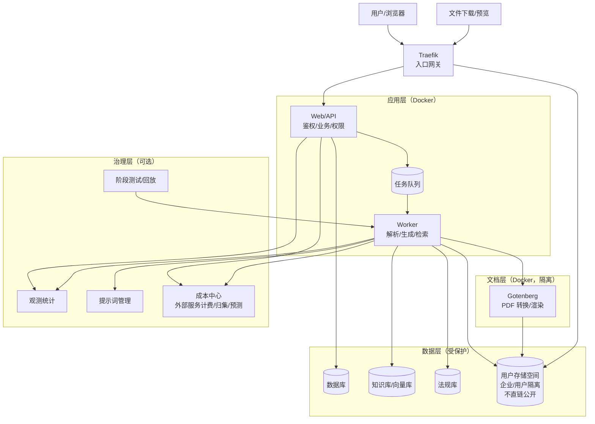

在 2026 年，我们着手对两个 AI 产品进行架构升级，主要目标是解决长期积累的安全隐患和稳定性问题，同时为后续的可复用 AI 能力做好铺垫。本文分享了我们最终落地的整体架构思路。

## 1. 背景

- 项目组近期出现较多安全问题，主要与代码与依赖长期未更新、升级成本高、发布回滚不够自动化等因素相关。

- 两个 AI 产品近期稳定性有波动（长任务、重文件、外部模型波动叠加），需要用架构与治理机制持续收敛。

- 2026 规划包含“可复用 AI 能力”，因此两套产品除业务交付外，也需要沉淀可复用底座。

---

## 2. 总体思路

- 高风险能力隔离：文件解析、格式转换、长时间生成与主业务解耦，降低影响面。

- 长任务异步化：请求先进入队列，后台 worker 处理，前台查看进度。

- 升级常态化：容器化交付，升级主要通过镜像更新与流水线校验完成，降低维护成本。

---

## 3. AI产品总体架构

---

## 4. 安全性设计

- 私有文件隔离：文件按企业/用户维度隔离存放。
- 受控访问：预览/下载必须通过 Web/API 鉴权，不提供可绕过的直链访问。
- 配置安全：敏感配置通过环境变量管理，避免硬编码与误提交。
- 升级可持续：容器化后依赖与系统库升级更易常态化执行，减少“长期不敢动”的风险。
- API限流：避免出现短信验证码恶意频繁发送等问题。

---

## 5. 稳定性与性能设计

- 异步队列：生成/解析等长耗时任务进入队列处理，避免阻塞主业务请求链路。
- 故障隔离：文档解析/转换/渲染等高风险组件独立运行，异常尽量不影响主站可用性。
- 可降级空间：高峰或外部依赖异常时，优先保障核心流程可用（排队、限流、简化非关键步骤、启用兜底策略）。
- 自恢复：关键服务通过健康检查与自动重启减少小故障扩散。

---

## 6. 2026 可复用 AI 能力设计

- ...

---

## 7. AI 治理配套能力

### 7.1 观测与统计
### 7.2 提示词版本管理
### 7.3 阶段测试与回放测试
### 7.4 成本统计与预测

---

## 8. 对其他项目组的迁移建议

...

## 9. 主要风险与需要支持

...

---

**本系列下一篇**：  
《我们为什么选择 Agent-Native 架构？BidRisk 产品实践总结》
