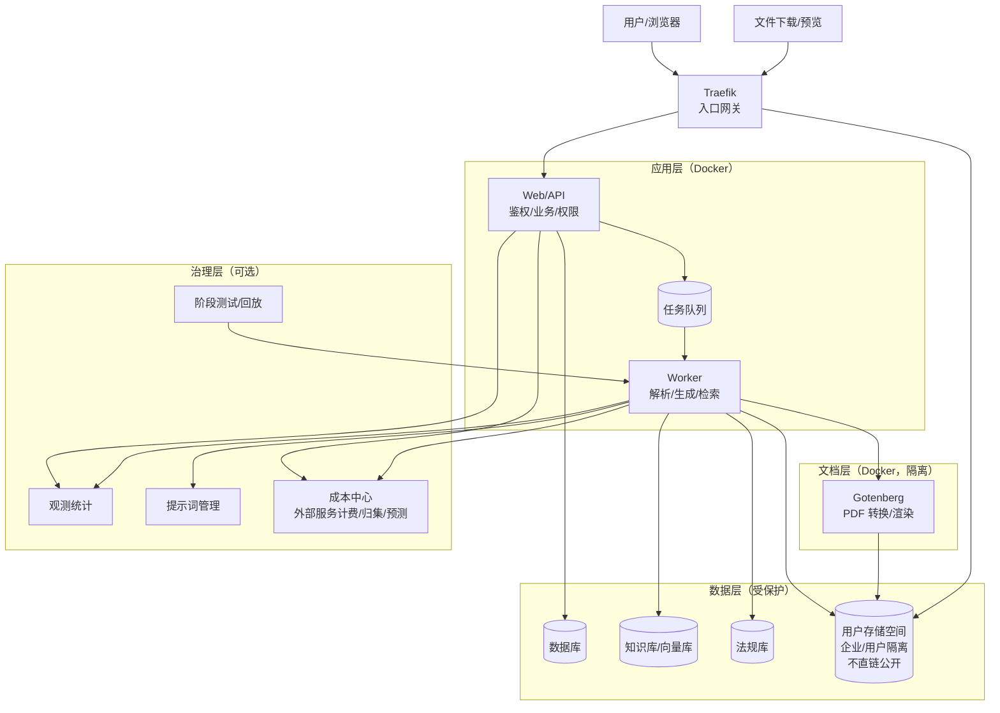
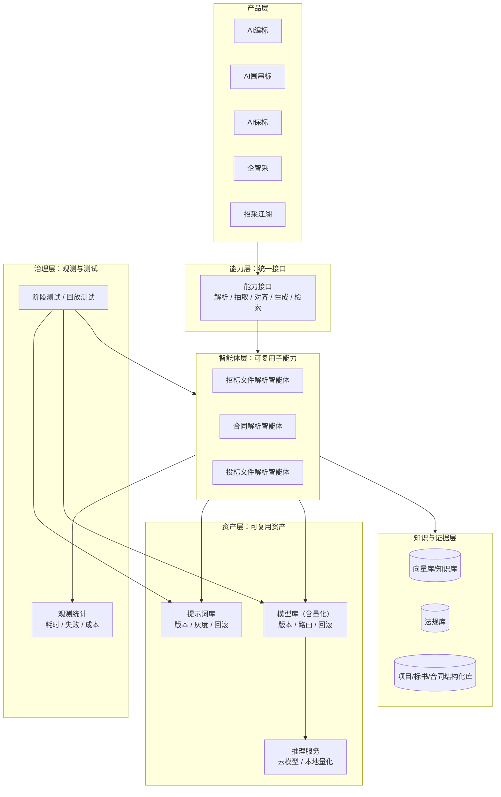

## 1. 背景

- 项目组近期出现较多安全问题，主要与代码与依赖长期未更新、升级成本高、发布回滚不够自动化等因素相关。

- 两个 AI 产品近期稳定性有波动（长任务、重文件、外部模型波动叠加），需要用架构与治理机制持续收敛。

- 2026 规划包含“可复用 AI 能力”，因此两套产品除业务交付外，也需要沉淀可复用底座。

---

## 2. 总体思路

- 高风险能力隔离：文件解析、格式转换、长时间生成与主业务解耦，降低影响面。

- 长任务异步化：请求先进入队列，后台 worker 处理，前台查看进度。

- 升级常态化：容器化交付，升级主要通过镜像更新与流水线校验完成，降低维护成本。

---

## 3. AI产品总体架构

---

## 4. 安全性设计

- 私有文件隔离：文件按企业/用户维度隔离存放。

- 受控访问：预览/下载必须通过 Web/API 鉴权，不提供可绕过的直链访问。

- 配置安全：敏感配置通过环境变量管理，避免硬编码与误提交。

- 升级可持续：容器化后依赖与系统库升级更易常态化执行，减少“长期不敢动”的风险。

- API限流：避免出现短信验证码恶意频繁发送等问题

---

## 5. 稳定性与性能设计

- 异步队列：生成/解析等长耗时任务进入队列处理，避免阻塞主业务请求链路。

- 故障隔离：文档解析/转换/渲染等高风险组件独立运行，异常尽量不影响主站可用性。

- 可降级空间：高峰或外部依赖异常时，优先保障核心流程可用（排队、限流、简化非关键步骤、启用兜底策略）。

- 自恢复：关键服务通过健康检查与自动重启减少小故障扩散。

- 关键指标口径：

---

## 6. 2026 可复用 AI 能力设计

- 产品层只依赖“能力接口”，不绑定具体模型或具体实现。

- 能力实现允许多版本并行演进，通过版本化与灰度机制降低替换风险。

- 通用能力优先复用：招标文件解析、章节切分、要点抽取、评分点对齐、风险项抽取、检索与引用等。

- 成本中心对不同模型/量化版本的成本与效果做对比，为“模型路由/灰度/回滚”提供依据。

---

## 7. AI 治理配套能力

### 7.1 观测与统计

- 每次调用记录：能力类型、实现版本/模型、提示词版本、耗时、结果结构合格性、失败原因、成本归集。以及
• 外部服务维度：服务类型（模型/短信/第三方 API）、供应商、计费单位
• 成本维度：预估成本、实际成本、归集维度（企业/项目/能力/任务）

- 目标：问题可定位、可对比、可复盘。

### 7.2 提示词版本管理

- 提示词版本化、灰度发布、异常可回滚。

- 调用记录必须关联提示词版本，确保问题可复现与追踪。

### 7.3 阶段测试与回放测试

- 单步测试：针对某个节点校验输出结构与关键字段。

- 回放测试：使用历史样本对比新旧版本差异，超阈值阻断发布。

- 目标：减少改动引入的整体漂移与反复问题。

### 7.4 成本统计与预测（外部服务）

- 成本归集：统一由“成本中心”记录模型调用、短信发送、第三方 API 调用等成本，支持按企业/项目/能力/任务维度汇总。

- 成本预算：支持配置预算与阈值（按企业/项目/能力），触发后可告警或降级（例如切换更便宜模型、降低并发、延后非关键步骤）。

- 成本预测：基于历史任务量与单任务成本，输出月度/季度成本预测，用于提前评估资源与费用风险。

---

## 8. 对其他项目组的迁移建议（先交付标准化，再谈演进）

1. 先容器化运行：解决环境一致、部署可复制、回滚更确定。

1. 再引入发布前校验：依赖更新、漏洞扫描、基础测试进入流水线门禁。

1. 最后再讨论拆分：在交付与观测能力具备后再考虑更深的架构演进。

---

## 9. 主要风险与需要支持

- 稳定性改进需要固定指标、发布门禁、降级策略与演练机制，避免问题反复。

- 跨组推广建议建立公司级最低基线（依赖更新节奏、发布前校验、漏洞修复时限），提升持续执行力度。